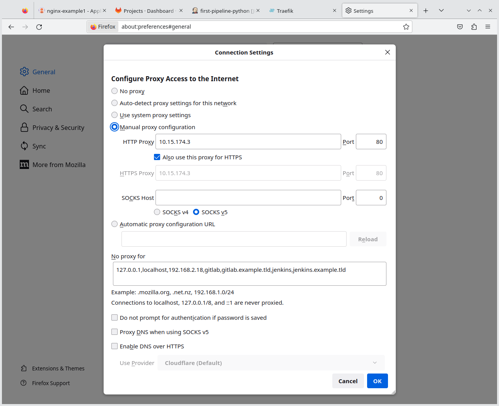

- [Preparations](#preparations)
- [Deploy ArgoCD in Kubernetes](#deploy-argocd-in-kubernetes)
- [Post Installation Tasks](#post-installation-tasks)
  - [Add hosts entry](#add-hosts-entry)
  - [Web Browser Proxy Configuration](#web-browser-proxy-configuration)
- [Test](#test)
- [Other useful commands](#other-useful-commands)

# Preparations

There are some values that need to be edited in the values file.

To get the original values, run the following command:

```shell
helm show values argo/argo-cd --version=5.33.1 > argocd-helm-values.yaml
```

One of the major changes was to add _**Ingress**_ to the configuration.

# Deploy ArgoCD in Kubernetes 

Run the following commands:

```shell
# Only needed once. Not required if this command was tun previously
helm repo add argo https://argoproj.github.io/argo-helm

kubectl create namespace argocd

helm install -n argocd argocd argo/argo-cd --version=5.33.1 -f lab_artifacts/argocd-helm-values.yaml

kubectl -n argocd get secret argocd-initial-admin-secret -o jsonpath="{.data.password}" | base64 -d
# Expect something like doLsjoj1F8cTyrf9
```

> **Note**
> Save the admin password returned from the last command.

# Post Installation Tasks

## Add hosts entry

In order to use the web based UI from ArgoCD, a couple of extra steps is required to connect via the deployed Ingress configuration.

> **Note**
> Normally a Load Balancer will be used to connect ot the various proxy end-points exposed by the Ingress controller. However, to simplify the LAB environment, only one IP address of the cluster will be chosen as the entry point and in a web browser of your choice you would need to point to that Node IP address. Also, since this is a LAB environment, DNS for certain hosts are simulated by hosts file entries.

First, get the IP addresses of the nodes:

```shell
multipass list
```

Example output:

```text
Name                    State             IPv4             Image
node1                   Running           10.15.174.149    Ubuntu 22.04 LTS
                                          10.42.0.0
                                          10.42.0.1
node2                   Running           10.15.174.129    Ubuntu 22.04 LTS
                                          10.42.1.0
                                          10.42.1.1
node3                   Running           10.15.174.132    Ubuntu 22.04 LTS
                                          10.42.2.0
                                          10.42.2.1
node4                   Running           10.15.174.3      Ubuntu 22.04 LTS
                                          10.42.3.0
                                          10.42.3.1
```

Pick any of the primary IP addresses (one of `10.15.174.3`, `10.15.174.132`, `10.15.174.129` or `10.15.174.149` - but relevant to your environment)

Add the hosts entry:

```shell
sudo cp /etc/hosts /etc/hosts_BACKUP_lab_02

sudo echo "10.15.174.3   argocd argocd-grpc argocd.example.tld argocd-grpc.example.tld" >> /etc/hosts
```

## Web Browser Proxy Configuration

For the LAB environment, it is recommended you use a separate browser profile.

In Firefox, the proxy settings should be the following:



The `no-proxy` settings (for easy copy/paste):

```text
127.0.0.1,localhost,192.168.2.18,gitlab,gitlab.example.tld,jenkins,jenkins.example.tld
```

> **Note**
> The `192.168.2.18` IP address, is the IP address of the LAB system

# Test

After the installation and post-installation tasks are done, point your LAB browser to http://argocd.example.tld/

Login with the username `admin` and the password saved from the setup steps.

# Other useful commands

List all available Helm versions:

```shell
helm search repo argo/argo-cd -l
```

