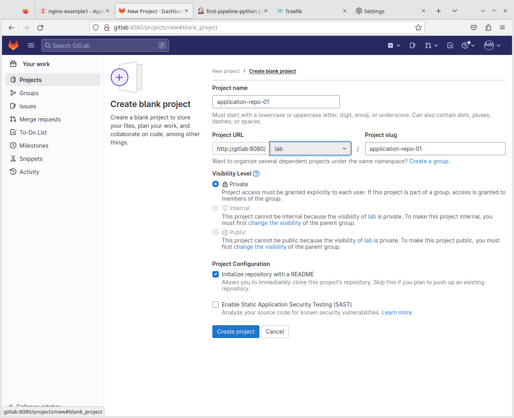
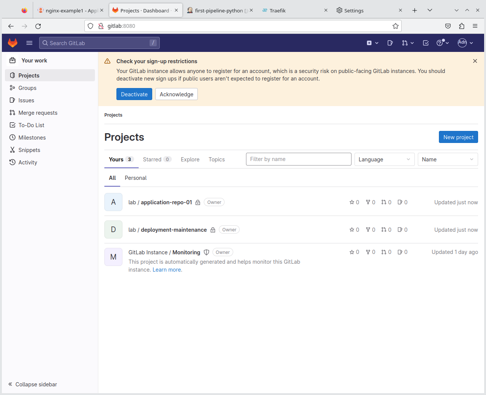
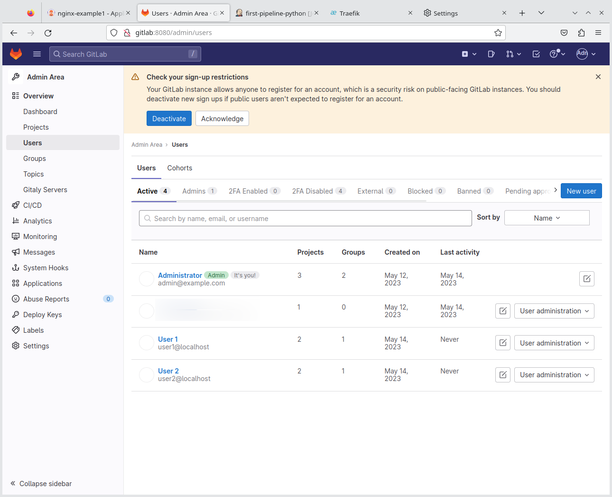

- [Why Gitlab and why Docker?](#why-gitlab-and-why-docker)
- [Preparing Docker](#preparing-docker)
- [Running Gitlab in Docker](#running-gitlab-in-docker)
- [Post Installation Tasks](#post-installation-tasks)
  - [Add hosts entry](#add-hosts-entry)
  - [Add Users](#add-users)
  - [Create a LAB group in Gitlab](#create-a-lab-group-in-gitlab)
  - [Import Initial Projects](#import-initial-projects)


# Why Gitlab and why Docker?

Gitlab is my my humble opinion one of the fully featured Git servers that is the easiest to setup in a standalone/dedicated hosting environment.

Technically you could run Gitlab in Kubernetes, but in the last 20+ years of using Git, and even today, I still find most enterprises running Git either a standalone version or a newer cloud version (SaaS). The popular Git services you are most likely to find include Gitlab, GitHub and BitBucket.

Running Gitlab in DOcker therefore very closely resembles "real life" and since we are not too concerned about most of the power features in this LAB, Gitlab is a perfect option that is really easy to deploy and use.

More advanced users who want to take advantage of some more powerful built-in CI features in their respective Git application can easily skip this step and adjust some of the other configurations or commands to suite their needs.

# Preparing Docker

You will need to edit your systemd Docker configuration in `/lib/systemd/system/docker.service`

Replace the line `ExecStart=/usr/bin/dockerd -H fd:// --containerd=/run/containerd/containerd.sock` with:

```text
ExecStart=/usr/bin/dockerd -H tcp://0.0.0.0:4243 -H unix:///var/run/docker.sock
```

Afterwards run:

```shell
sudo systemctl daemon-reload

sudo service docker restart
```

> **Note**
> This step is technically only required from the Jenkins step, but doing this at this early stage prevents any potential issues with Gitlab later on 

> **Warning**
> This process will make your LAB environment insecure and it is highly recommended that he LAB network is in a network that does not allow any direct connection from the Internet. 

# Running Gitlab in Docker

> **Warning**
> Gitlab can be fairly resource intensive. If your system has 32 GiB or less RAM, I would recommend running Gitlab on a second computer.

The commands below is essentially a summary of the [official documentation](https://docs.gitlab.com/ee/install/docker.html):

```shell
docker volume create gitlab_config

docker volume create gitlab_logs

docker volume create gitlab_data

docker run --detach \
  --hostname gitlab.example.com \
  --publish 8443:443 --publish 8080:80 --publish 8022:22 \
  --name gitlab \
  --restart always \
  --volume gitlab_config:/etc/gitlab \
  --volume gitlab_logs:/var/log/gitlab \
  --volume gitlab_data:/var/opt/gitlab \
  --shm-size 256m \
  gitlab/gitlab-ce:15.9.8-ce.0

# See when install is done via:
docker logs -f gitlab

# get the password:
docker exec -it gitlab grep 'Password:' /etc/gitlab/initial_root_password
```

# Post Installation Tasks

## Add hosts entry

Assuming your Docker installation was successful, run the following command:

```shell
sudo cp /etc/hosts /etc/hosts_BACKUP_lab_03

sudo echo "192.168.2.18    gitlab gitlab.example.tld jenkins jenkins.example.tld" >> /etc/hosts
```

## Add Users

In the LAB environment you could use just the `root` account, but in order to test some other features with multiple users, it is recommended you create at least 2x other normal users.

At the same time, it may be a good idea to also create 2x local Unix user accounts. Create SSH keys for each and add the public keys to the corresponding Gitlab users.

> **Note**
> It may be a good idea to use the same username for the Unix account as well as the Gitlab account. It will then allow you to user variables like `$USER` in commands as shown below

The following command adds two Unix user accounts that will be active for 1 week:

```shell
sudo useradd -m -s /usr/bin/zsh -c "LAB Test User" -e `date +%Y-%m-%d -d "+7 days"` lab_user_1

sudo useradd -m -s /usr/bin/zsh -c "LAB Test User" -e `date +%Y-%m-%d -d "+7 days"` lab_user_2

# Verify Expiry:
(sudo chage -l lab_user_1 && sudo chage -l lab_user_2) | grep "Account expires"

# Set password:
sudo passwd lab_user_1

sudo passwd lab_user_2

# To quickly change to one of the new user accounts (this will require only your root password and not the user password):
sudo su - lab_user_1
```

For each of the Unix users, you need to add some config to their `~/.ssh/config` file:

```shell
# Setup user keys
ssh-keygen -f $HOME/.ssh/gitlab_local_docker

cat > ~/.ssh/config << EOF
Host gitlab
    Hostname gitlab
    Port 8022
    IdentityFile $HOME/.ssh/gitlab_local_docker
    IdentitiesOnly yes
EOF

chmod 600 $HOME/.ssh/config
```

Assuming you have a repository called `test`, you can now clone the repository with:

```shell
git clone git@gitlab:$USER/test.git
```

Without the SSH config, you need to run the following:

```shell
GIT_SSH_COMMAND='ssh -i ~/.ssh/gitlab_local_docker -p 8022 -o IdentitiesOnly=yes' git clone git@gitlab:$USER/test.git
```

## Create a LAB group in Gitlab

Using the web UI, create a group called `lab` and add the test users with a role of `Developer` to the group.

Afterwards, as an administrative user (like `root`), create the following blank projects with a README.md for the `lab` group:

* `application-repo-01`
* `deployment-maintenance`

Creating a new project should look something like this:



Afterwards, you should see something like the following:



After adding the LAB users to the `lab` group, the users view in Gitlab should look something like this:



## Import Initial Projects

TODO
