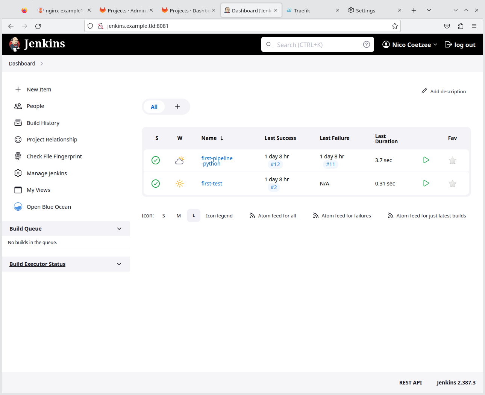
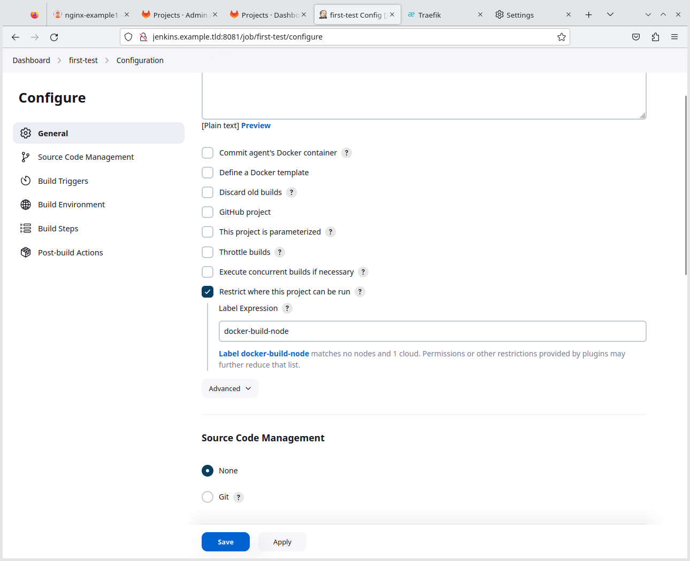

- [Why Jenkins and why Docker?](#why-jenkins-and-why-docker)
- [Deployment](#deployment)
  - [Main Jenkins Instance](#main-jenkins-instance)
  - [Build Nodes](#build-nodes)
- [Testing](#testing)
  - [First Freestyle Project](#first-freestyle-project)
  - [A Test Python Project](#a-test-python-project)

Quick Nav: [Main](./README.md) | [Task 1](./task_01_deploy_k3s.md) | [Task 2](./task_02_deploy_argocd_in_kubernetes.md) | [Task 3](./task_03_deploy_gitlab_docker.md) | Task 4 | [Task 5](./task_05_integrate_jenkins_and_gitlab.md) | [Task 6](./task_06_setup_jenkins_build_for_test_application.md) | [Notes](./NOTES.md)

# Why Jenkins and why Docker?

Jenkins have been used for years now and is a very well known and common CI tool. In many organizations in fulfills both the CI and CD roles.

Because it is likely to encounter Jenkins in the real, it is included in this lab. Keep in mind that there are a number of other tools and approaches. Even if you do not use Jenkins right now, it may still be good to at least follow the basic steps of this LAB to get it running, as it is perfect to illustrate some of the common CI approaches in modern Kubernetes systems, working alongside ArgoCD in cluster for CD tasks.

As with Gitlab, even if you can run Jenkins in Kubernetes, it is still most likely to run in dedicated server environments. This LAB, however, will take advantage of some more modern features of Jenkins to use Docker as build nodes.

# Deployment

The instructions are based on a combination of instructions from the following sources:

* https://www.jenkins.io/doc/book/installing/docker/
* https://devopscube.com/docker-containers-as-build-slaves-jenkins/
* https://phoenixnap.com/kb/how-to-configure-docker-in-jenkins
* https://www.jenkins.io/doc/pipeline/tour/hello-world/

## Main Jenkins Instance

Run the following commands:

```shell
mkdir /tmp/jenkins-deployment

cd /tmp/jenkins-deployment

cat > Dockerfile << EOF
FROM jenkins/jenkins:2.387.3
USER root
RUN apt-get update && apt-get install -y lsb-release
RUN curl -fsSLo /usr/share/keyrings/docker-archive-keyring.asc \
  https://download.docker.com/linux/debian/gpg
RUN echo "deb [arch=$(dpkg --print-architecture) \
  signed-by=/usr/share/keyrings/docker-archive-keyring.asc] \
  https://download.docker.com/linux/debian \
  $(lsb_release -cs) stable" > /etc/apt/sources.list.d/docker.list
RUN apt-get update && apt-get install -y docker-ce-cli
USER jenkins
RUN jenkins-plugin-cli --plugins "blueocean docker-workflow"
EOF

docker build -t myjenkins-blueocean:2.387.3-1 .

cd

docker volume rm jenkins-docker-certs

docker volume rm jenkins-data

docker volume create jenkins-docker-certs

docker volume create jenkins-data

docker network create jenkins

# NOTE !!!
#
#   Replace the IP addresses below with the relevant IP addresses for your environment

docker run \
  --name jenkins-docker \
  --rm \
  --detach \
  --privileged \
  --network jenkins \
  --network-alias docker \
  --add-host="argocd:10.15.174.3" \
  --add-host="argocd.example.tld:10.15.174.3" \
  --add-host="gitlab:192.168.2.18" \
  --add-host="gitlab.example.tld:192.168.2.18" \
  --add-host="jenkins:192.168.2.18" \
  --add-host="jenkins.example.tld:192.168.2.18" \
  --env DOCKER_TLS_CERTDIR=/certs \
  --volume jenkins-docker-certs:/certs/client \
  --volume jenkins-data:/var/jenkins_home \
  --publish 2376:2376 \
  docker:dind \
  --storage-driver overlay2

docker run \
  --name jenkins-blueocean \
  --restart=on-failure \
  --detach \
  --network jenkins \
  --add-host="argocd:10.15.174.3" \
  --add-host="argocd.example.tld:10.15.174.3" \
  --add-host="gitlab:192.168.2.18" \
  --add-host="gitlab.example.tld:192.168.2.18" \
  --add-host="jenkins:192.168.2.18" \
  --add-host="jenkins.example.tld:192.168.2.18" \
  --env DOCKER_HOST=tcp://docker:2376 \
  --env DOCKER_CERT_PATH=/certs/client \
  --env DOCKER_TLS_VERIFY=1 \
  --publish 8081:8080 \
  --publish 50000:50000 \
  --volume jenkins-data:/var/jenkins_home \
  --volume jenkins-docker-certs:/certs/client:ro \
  myjenkins-blueocean:2.387.3-1

# Get the admin password
docker exec jenkins-blueocean cat /var/jenkins_home/secrets/initialAdminPassword
# Expect something like: e2de805097644d4384a8994773121d02
```

The first visit to the Jenkins Web UI must be to the IP address, for example: http://192.168.2.18:8081

Some tasks you can do now (without showing the details):

* Create a user
* Update any plugins due for update
* Restart Jenkins (as part of the plugin update)
* Set the hostname to something like `jenkins.example.tld` (the entry was already added to `/etc/hosts` during the Gitlab installation task)

## Build Nodes

> **Warning**
> For this step you need to push an image to Docker Container. The LAB assumes you have a Docker Hub account. Adjust your commands as required when using other Container Repositories.

Run the following commands:

```shell
# Make sure you are logged in to your docker hub account:
docker login

# Generate an SSH key in Jenkins
docker exec -it jenkins-blueocean ssh-keygen

# Generate an SSH keys for GitLab Integration
docker exec -it jenkins-blueocean ssh-keygen -f /var/jenkins_home/.ssh/jenkins_gitlab

docker exec -it jenkins-blueocean cat /var/jenkins_home/.ssh/jenkins_gitlab > jenkins_gitlab

docker exec -it jenkins-blueocean cat /var/jenkins_home/.ssh/jenkins_gitlab.pub > jenkins_gitlab.pub

# Prep the build noe
mkdir /tmp/buildnode

cd /tmp/buildnode

docker exec -it jenkins-blueocean cat /var/jenkins_home/.ssh/id_rsa.pub > authorized_keys

# Get the runninng java version
docker exec -it jenkins-blueocean java --version
# Expect to see the following lines:
#   openjdk 11.0.19 2023-04-18
#   OpenJDK Runtime Environment Temurin-11.0.19+7 (build 11.0.19+7)
#   OpenJDK 64-Bit Server VM Temurin-11.0.19+7 (build 11.0.19+7, mixed mode)

# Create SSH config for Gitlab
cat > config << EOF
Host gitlab
    Hostname gitlab
    Port 8022
    IdentityFile /home/jenkins/.ssh/jenkins_gitlab
    IdentitiesOnly yes
EOF

ssh-keyscan -p8022 gitlab > known_hosts

# NOTE: The openjdk below must match the openjdk version on jenkins-blueocean (see above)
cat > Dockerfile << EOF
FROM ubuntu:22.04
RUN apt-get update && \
    apt-get -qy full-upgrade && \
    apt-get install -qy git python3 python3-pip && \
    apt-get install -qy openssh-server && \
    sed -i 's|session    required     pam_loginuid.so|session    optional     pam_loginuid.so|g' /etc/pam.d/sshd && \
    mkdir -p /var/run/sshd && \
    apt-get install -qy openjdk-11-jdk && \
    apt-get install -qy maven && \
    apt-get -qy autoremove && \
    adduser --quiet jenkins && \
    echo "jenkins:jenkins" | chpasswd && \
    mkdir /home/jenkins/.m2
COPY authorized_keys /home/jenkins/.ssh/authorized_keys
# COPY jenkins_gitlab /home/jenkins/.ssh/jenkins_gitlab
# COPY jenkins_gitlab.pub /home/jenkins/.ssh/jenkins_gitlab.pub
RUN su -c "ssh-keygen -q -N '' -f /home/jenkins/.ssh/jenkins_gitlab" jenkins
COPY known_hosts /home/jenkins/.ssh/known_hosts
COPY config /home/jenkins/.ssh/config
RUN chown -R jenkins:jenkins /home/jenkins/.m2/ && \
    chown -R jenkins:jenkins /home/jenkins/.ssh/
RUN chmod 700 /home/jenkins/.ssh
RUN chmod 600 /home/jenkins/.ssh/*
RUN echo "192.168.2.18    gitlab gitlab.example.tld jenkins jenkins.example.tld" >> /etc/hosts
EXPOSE 22
CMD ["/usr/sbin/sshd", "-D"]
EOF

docker build --no-cache -t jenkins-slave-modified .

export LATEST_IMAGE_ID=`docker image ls | grep jenkins-slave-modified | grep -v $USER | awk '{print $3}'`

# This command assumes you are using Docker Hub. Adjust the tag to suite your container registry needs.
docker tag $LATEST_IMAGE_ID $USER/jenkins-slave-modified:latest

# This assumes you have a Docker Hub user with the username the same as your Linux username... Adjust to suite your needs.
docker push $USER/jenkins-slave-modified:latest

# NOTE: Add this key in GitLab for the Jenkins User - required to PUSH to git
docker run -it --user=jenkins jenkins-slave-modified cat /home/jenkins/.ssh/jenkins_gitlab.pub

cd
```

> **Note**
> The last docker command is important as you need to create a user in Gitlab for Jenkins and then add this SSH public key to that user. This is what will allow Jenkins to do Git PUSH and other commands. More details for the integration is [in the task](./task_05_integrate_jenkins_and_gitlab.md).

Final Tasks

* Install the Docker plugin
* Configure Docker Cloud as described in https://devopscube.com/docker-containers-as-build-slaves-jenkins/
    * In the LAB, the label `docker-build-node` refers to the Docker build nodes.

# Testing



Create a test build or two.

Below are two examples:

## First Freestyle Project

Create a freestyle project, as describe on the page https://phoenixnap.com/kb/how-to-configure-docker-in-jenkins

> **Note**
> Pay special attention to the project configuration to ensure that the Docker build nodes are used:



It should build on a Docker node without any issues:


## A Test Python Project

Following the instruction from https://www.jenkins.io/doc/pipeline/tour/hello-world/ - create a Python project and test.

The following is a slightly modified Groovy script for this task:

```groovy
pipeline {
    //agent { docker { image 'python:3.10.7-alpine' } }
    agent { node { label "docker-build-node" }}
    stages {
        stage('build') {
            steps {
                sh 'python3 --version'
            }
        }
    }
}
```


When configuring the Jenkins Project, take note of the Webhook URL.

Quick Nav: [Main](./README.md) | [Task 1](./task_01_deploy_k3s.md) | [Task 2](./task_02_deploy_argocd_in_kubernetes.md) | [Task 3](./task_03_deploy_gitlab_docker.md) | Task 4 | [Task 5](./task_05_integrate_jenkins_and_gitlab.md) | [Task 6](./task_06_setup_jenkins_build_for_test_application.md) | [Notes](./NOTES.md)