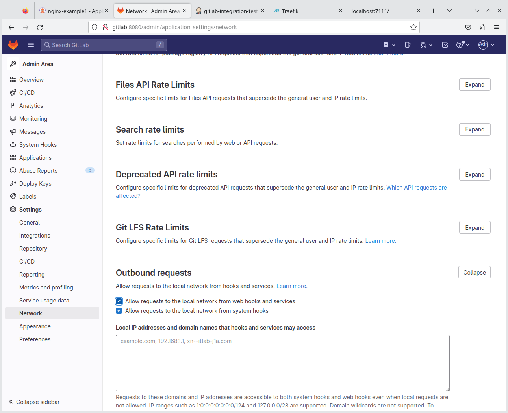
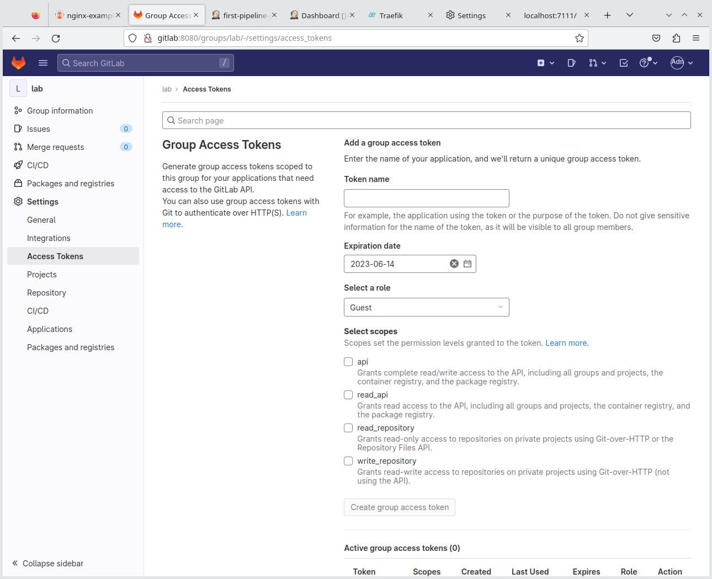
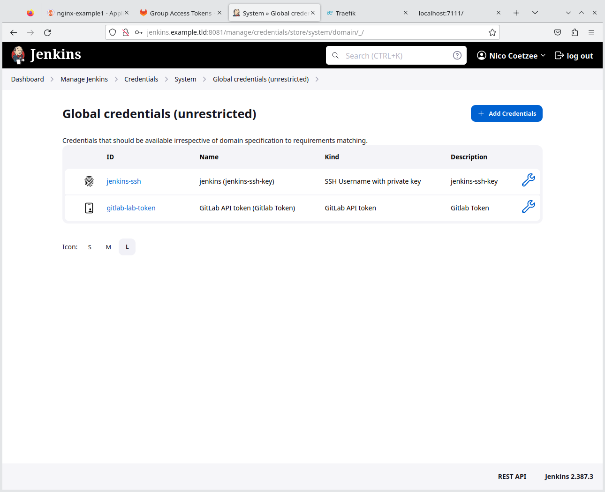
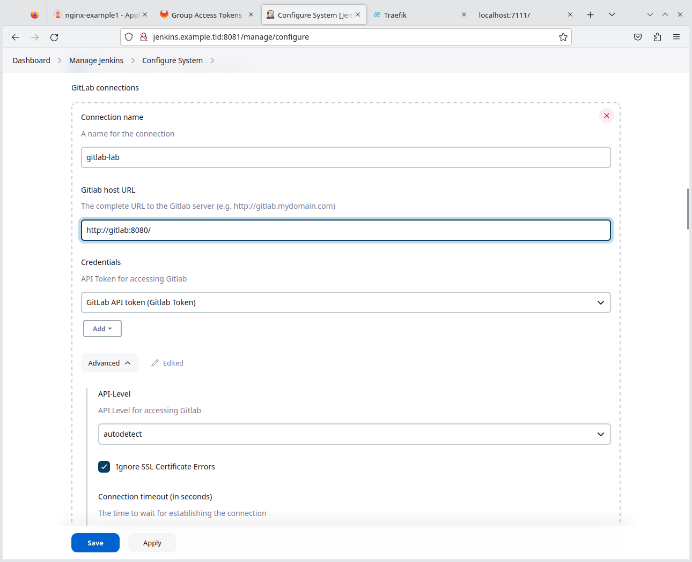
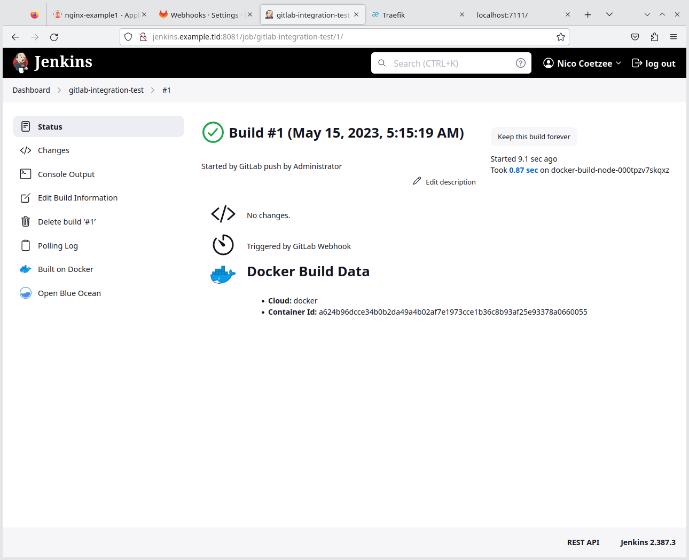
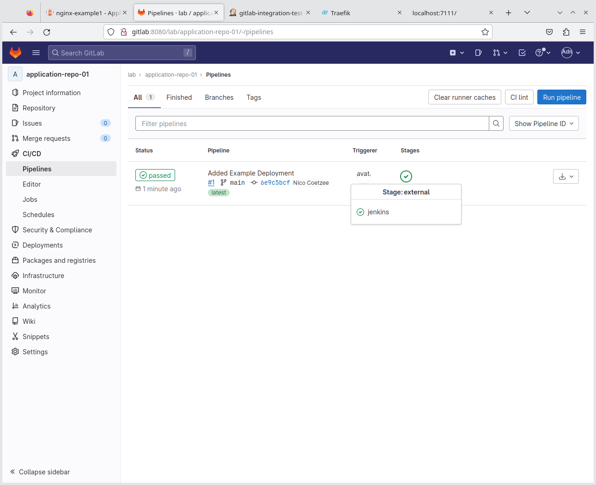

- [Webhook Integration Test](#webhook-integration-test)
  - [Preparation](#preparation)
  - [Integration Steps](#integration-steps)
  - [Testing and Verification](#testing-and-verification)
- [Normal Git Integration for Jenkins to Gitlab](#normal-git-integration-for-jenkins-to-gitlab)
  - [Create a Jenkins User in Gitlab](#create-a-jenkins-user-in-gitlab)
  - [Create Git Credentials in Jenkins](#create-git-credentials-in-jenkins)
- [References](#references)


# Webhook Integration Test

This section illustrate a webhook integration, but this is optional. The section is intended for those wanting to experiment with webhook based integration.

## Preparation

Before starting, by using a user with administrative rights on Gitlab, enable requests on the local network:



## Integration Steps

Follow the instructions from [the Gitlab documentation](https://docs.gitlab.com/ee/integration/jenkins.html) to integrate Jenkins on Group level, using the `lab` group.

To create a group access token, follow [these instructions](https://docs.gitlab.com/ee/user/group/settings/group_access_tokens.html#create-a-group-access-token-using-ui) from the Gitlab documentation.

> **Note**
> These actions require a user with Administrative access. 

The access token on group level have a screen that looks like this:



After the group access token is created, ensure to copy the token value as this will be used in Jenkins.

> **Warning**
> You have to copy the Token while on that screen as there is no way to obtain it again afterwards. If the token value is lost, you need to recreate the token.

In Jenkins, you must first create install the Gitlab plugin, and then afterwards create a Gitlab token credentials:



Afterward, the Gitlab connection can be made in the Jenkins System Configuration page:



Back in Gitlab, opt for adding the Webhook to integrate a project with Jenkins - pick the `application-repo-1` project for the first test.

> **Warning**
> Since we are not using SSL, ensure the `SSL Verification` option is _**not**_ selected.

## Testing and Verification

Once both sides have been integrated, on Gitlab the webhook can be tested by simulating a PUSH event.

On both Jenkins and Gitlab the event and integration can then be verified:





# Normal Git Integration for Jenkins to Gitlab

This section demonstrates how to integrate Jenkins to Gitlab using normal SSH integration for each Git repository cloning and related tasks. This is required in this lab demonstration where Helm charts will be generated and pushed to the `deployment-maintenance` repository.

## Create a Jenkins User in Gitlab

In Gitlab create a user called `jenkins`, but without a password. Using the administrator account, impersonate this user and add the Jenkins SSH public key.

To get the Jenkins public key, run the following command:

```shell
docker exec -it jenkins-blueocean cat /var/jenkins_home/.ssh/jenkins_gitlab.pub
```

## Create Git Credentials in Jenkins

In Jenkins navigate to: `Dashboard > Manage Jenkins > Credentials > System > Global credentials`

Click the `+ Add Credentials` button.

Add a `SSH Username with private key`.

Run the following command to get the private key:

```shell
docker exec -it jenkins-blueocean cat /var/jenkins_home/.ssh/jenkins_gitlab
```

The username must be the same as the username created in Gitlab.

# References

* Gitlab Plugin Documentation: https://plugins.jenkins.io/gitlab-plugin/
* Gitlab Webhook Documentation: https://docs.gitlab.com/ee/user/project/integrations/webhooks.html
