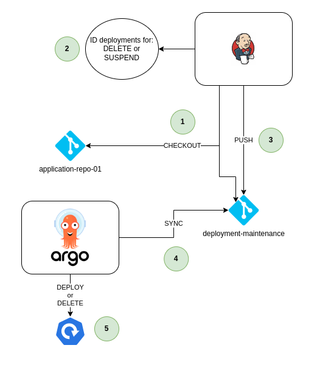

- [Task Overview and Objectives](#task-overview-and-objectives)
  - [Objective 1 Goals](#objective-1-goals)
  - [Objective 2 Goals](#objective-2-goals)

# Task Overview and Objectives

This is probably one of the more important tasks, as this is where the configuration is done for building our final Helm charts and configuring ArgoCD to deploy our application in Kubernetes.

> **Note**
> It is vital for this step to ensure that Jenkins and Gitlab is properly integrated as described in [task 05](./task_05_integrate_jenkins_and_gitlab.md).

There are two main objectives:

* Objective 1: Create the CI and CD pipeline to act on changes in the application repository and deploy those changes to Kubernetes
* Objective 2: Create a maintenance pipeline to remove expired deployments and to suspend/un-suspend application deployments based on their application tag values.

## Objective 1 Goals

The goal is to implement the following steps:

| Step | Description                                                                                                             |
|:----:|-------------------------------------------------------------------------------------------------------------------------|
| 1    | Developers will work on the project. Occasionally a change will be pushed to the Git repository.                        |
| 2    | Gitlab will act on the events as per configuration, and call the Webhook to Jenkins based on the configuration.         |
| 3    | Jenkins will first Checkout both the `application-repo-01` and `deployment-maintenance` repositories.                   |
| 4    | In the build process, Jenkins will prepare the Helm template and create a new deployment (namespaced)                   |
| 5    | Jenkins push the updated Helm charts and application manifest to the `deployment-maintenance` repository                |
| 6    | ArgoCD will synchronize the changes from the `deployment-maintenance` repository                                        |
| 7    | The new application is deployed in the Kubernetes cluster                                                               |

## Objective 2 Goals

Each application may reach one of two important milestones:

1. Suspend the application (or deploy a previously suspended application)
2. Delete expired applications

From a pipeline perspective, the picture looks very similar to the previous one, except there is no trigger from Git but rather a schedule for the maintenance pipeline, which will be run at regular intervals from Jenkins.

For the pipeline to perform actions on a application deployment, the following labels must be present, which will form part of the Helm chart:

* `expires`: With a Unix timestamp in UTC by which time the application will be deleted from the cluster. Default expiry is 30 minutes after deployment (for LAB testing)
* `suspend-start`: with a unix timestamp of when the suspend action will start. Default is to suspend 5 minutes after the initial deployment and the crontab will be calculated therefore relative to the deployment timestamp.
* `suspend-end`: with a unix timestamp of when the suspend action will stop. The suspend will end 10 minutes before the application is scheduled for deletion, calculated relative to the deployment timestamp

> **Note**
> Any time value mentioned above is optimized for LAB conditions and the intervals are relative short. Real world intervals will be much higher.

