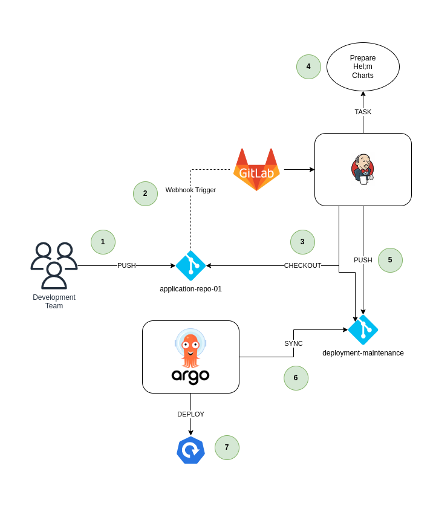

- [Task Overview and Objectives](#task-overview-and-objectives)

# Task Overview and Objectives

This is probably one of the more important tasks, as this is where the configuration is done for building our final Helm charts and configuring ArgoCD to deploy our application in Kubernetes.

> **Note**
> It is vital for this step to ensure that Jenkins and Gitlab is properly integrated as described in [task 05](./task_05_integrate_jenkins_and_gitlab.md).

The goal is to implement the following steps:

