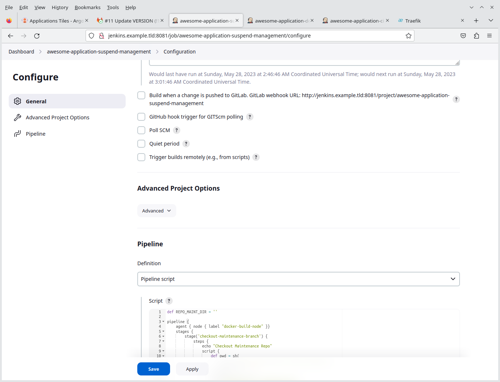

- [Task Overview and Objectives](#task-overview-and-objectives)
  - [Objective 1 Goals](#objective-1-goals)
  - [Objective 2 Goals](#objective-2-goals)
- [Interim Step - Connect ArgoCD and Gitlab](#interim-step---connect-argocd-and-gitlab)
- [Triggering Deployments When a Merge Request is Opened](#triggering-deployments-when-a-merge-request-is-opened)
  - [Scenario](#scenario)
  - [Preparing the Jenkins Pipeline](#preparing-the-jenkins-pipeline)
  - [Configure the Gitlab Webhook](#configure-the-gitlab-webhook)
  - [Pipeline Expectations](#pipeline-expectations)
  - [An example of a working pipeline](#an-example-of-a-working-pipeline)
    - [Create a Issue](#create-a-issue)
    - [Create a Branch](#create-a-branch)
    - [First Updates](#first-updates)
    - [Create new Merge Request](#create-new-merge-request)
    - [Jenkins Build](#jenkins-build)
    - [Verify Pipeline Status in Gitlab](#verify-pipeline-status-in-gitlab)
    - [Confirm the Deployment in ArgoCD](#confirm-the-deployment-in-argocd)
    - [(Optional) Confirm Ingress](#optional-confirm-ingress)
    - [(Optional) Confirm the Application is Working](#optional-confirm-the-application-is-working)
    - [View all other Deployments](#view-all-other-deployments)
- [Deployment Management Pipelines](#deployment-management-pipelines)
  - [The `awesome-application-suspend-management` pipeline](#the-awesome-application-suspend-management-pipeline)
  - [The `awesome-application-delete-expired` pipeline](#the-awesome-application-delete-expired-pipeline)
- [Pipeline Executions](#pipeline-executions)
  - [Guidance for testing](#guidance-for-testing)


# Task Overview and Objectives

This is probably one of the more important tasks, as this is where the configuration is done for building our final Helm charts and configuring ArgoCD to deploy our application in Kubernetes.

> **Note**
> It is vital for this step to ensure that Jenkins and Gitlab is properly integrated as described in [task 05](./task_05_integrate_jenkins_and_gitlab.md).

There are two main objectives:

* Objective 1: Create the CI and CD pipeline to act on changes in the application repository and deploy those changes to Kubernetes
* Objective 2: Create a maintenance pipeline to remove expired deployments and to suspend/un-suspend application deployments based on their application tag values.

## Objective 1 Goals

The goal is to implement the following steps:


| Step | Description                                                                                                             |
|:----:|-------------------------------------------------------------------------------------------------------------------------|
| 1    | Developers will work on the project. Occasionally a change will be pushed to the Git repository.                        |
| 2    | Gitlab will act on the events as per configuration, and call the Webhook to Jenkins based on the configuration.         |
| 3    | Jenkins will first Checkout both the `application-repo-01` and `deployment-maintenance` repositories.                   |
| 4    | In the build process, Jenkins will prepare the Helm template and create a new deployment (namespaced)                   |
| 5    | Jenkins push the updated Helm charts and application manifest to the `deployment-maintenance` repository                |
| 6    | ArgoCD will synchronize the changes from the `deployment-maintenance` repository                                        |
| 7    | The new application is deployed in the Kubernetes cluster                                                               |

## Objective 2 Goals

Each application may reach one of two important milestones:

1. Suspend the application (or deploy a previously suspended application)
2. Delete expired applications

From a pipeline perspective, the picture looks very similar to the previous one, except there is no trigger from Git but rather a schedule for the maintenance pipeline, which will be run at regular intervals from Jenkins.


For the pipeline to perform actions on a application deployment, the following labels must be present, which will form part of the Helm chart:

* `expires`: With a Unix timestamp in UTC by which time the application will be deleted from the cluster. Default expiry is 60 minutes after deployment (for LAB testing)
* `suspend-start`: with a unix timestamp of when the suspend action will start. Default is to suspend 5 minutes after the initial deployment and the crontab will be calculated therefore relative to the deployment timestamp.
* `suspend-end`: with a unix timestamp of when the suspend action will stop. For the LAB, a suspend will not last more than 5 minutes
* `maximum-uptime`: A time unit in seconds between the last `suspend-end` and the next `suspend-start` and for the LAB this period is 10 minutes or 600 seconds.

> **Note**
> Any time value mentioned above is optimized for LAB conditions and the intervals are relative short. Real world intervals will be much higher.

# Interim Step - Connect ArgoCD and Gitlab

For the deployments to actually work, there needs to be integration between ArgoCD and Gitlab. Fortunately, this is relatively easy.

There are numerous ways to accomplish this and more information is available in [the ArgoCD Documentation](https://argo-cd.readthedocs.io/en/stable/operator-manual/declarative-setup/#repositories) on exactly how to connect to repositories.

In this example, it is assumed there is a user created in Gitlab specifically for ArgoCD. The connection will be over HTTP with authentication.

> **Warning**
> In a LAB environment it is sometimes useful to not use HTTPS in order to use tools like Wireshark to inspect traffic on the wire. However, this setup is _**extremely**_ insecure and systems in this configuration should ideally be completely isolated in a lab network with tight security controls. Use these steps at your own risk!

> **Note** 
> For real world usage, SSH is probably the more secure way to integrate.

After a user is created in Gitlab, navigate to the `deployment-maintenance` repository and copy the HTTPS clone url. It may look something like this, depending on your configuration: `http://gitlab:8080/lab/deployment-maintenance.git`

In ArgoCD, add the repository clone url together with the appropriate credentials:


> **Note**
> Follow the same steps to also add the repository `application-repo-01/`

After the repository is successfully connected, the following screen should greet you:


After the Gitlab repository is configured in the ArgoCD, the master application can now be deployed.

There are two options: either use the file `deployment-maintenance/root_application.yaml` from this repository, or use the `deployment-maintenance` project in gitlab, where the `root_application.yaml` file is in the root directory of the project.

Below is an example command, assuming the working directory is the same directory where the file is located:

```shell
kubectl apply -f root_application.yaml -n argocd
```

In ArgoCD you should see something like the following: 


The root application will monitor for manifests to deploy in the `deployment-maintenance` repository, specifically in the `deployments/lab/application-manifests` directory.

Another way to view the configuration is by issues the following commands on the command line:

```shell
kubectl get applications -n argocd

kubectl describe application lab-applications -n argocd
```

The information will be the same as can be seen in ArgoCD:


# Triggering Deployments When a Merge Request is Opened

## Scenario 

There can be multiple points at which various builds need to be triggered in an automated way. To keep the LAB simple enough to demonstrate the core principles, the LAB environment will only trigger new deployments when a new merge request is created and when a user comments with a specific string in the comments of the merge request to manually invoke another build, possibly after some additional commits to a specific branch was made and assuming a deployment is not required for every push event, which may lead to a lot of deployments that will be generally unused.

## Preparing the Jenkins Pipeline

In Jenkins, create a new pipeline and use the script file [lab_artifacts/pipeline_script_awesome-application-ci.groovy](./lab_artifacts/pipeline_script_awesome-application-ci.groovy).

The pipeline below was named `awesome-application-ci`. 

> **Note**
> The concept illustrated in this example and scenario is where Jenkins performs some "_build_" on the `application-repo-01` repository. However, there is not much really to build in reality since the project is a very simple project consisting only of Kubernetes manifests. However, Jenkins will also, as part of the build process, create the deployment artifacts for the LAB environment in the form of Helm charts which will be placed in a deployment directory in the `deployment-maintenance` repository. The actual Helm chart generation is delegated to a Python script run from a shell command in the Jenkins pipeline. The Python script is passed several parameters from the Jenkins pipeline. The Python script can be found in the `deployment-maintenance` repository, which is also in this repository in the file [deployment-maintenance/application_helm_integration.py](./deployment-maintenance/application_helm_integration.py)

In general, the following options must be set (screenshots):


## Configure the Gitlab Webhook

Similar to creating the test hook, create a hook for the merge requests as indicated on the screenshots below:


## Pipeline Expectations

Referencing back to the diagram at the top of this page, the expectation is as follow:

1. Someone would create a new Issue in Gitlab.
2. Once the issue is created, a new branch is created from the issue. To keep things simple, the name of the branches have been simplified in the examples to `issue-###`, which also allows for shorted namespace names during deployments.
3. Updates are made and committed to the new branch.
4. At some point a Merge (aka Pull Request, in some other popular products) request is created. At this time an initial build should be started on Jenkins with the changes up to that point. The Jenkins build should create the deployment artifacts which ArgoCD will pick-up and deploy
5. Some more commits may be required as testing in Kubernetes highlights some issues. After these commits, and at some point which is convenient, a message can be put in the Merge Request in the format `Jenkins please retry a build`
6. Finally, the Merge request is resolved and the merge is done. At this point the LAB assumes some other pipeline will cover the deployments of the main branch.

## An example of a working pipeline

Below is a simple walk through

### Create a Issue


### Create a Branch


> **Note**
> The branch name, to keep things simple, is in the format `issue-###`

### First Updates


> **Note**
> Here we demonstarte editing directly in the Gitlab environment. This is only for demonstration purposes.


### Create new Merge Request


> **Note**
> As soon as the merge request is opened, the details will be sent to Jenkins using the configured web hook

### Jenkins Build


> **Note**
> This is a LAB environment, so expect a lot of times that things may appear broken - exactly as shown in  the screenshot!

### Verify Pipeline Status in Gitlab


### Confirm the Deployment in ArgoCD 


> **Warning**
> It may take a couple of minutes for ArgoCD to synchronize. If you are in a hurry, you could also manually force a refresh of the `lab-applications` deployment

### (Optional) Confirm Ingress


### (Optional) Confirm the Application is Working


### View all other Deployments


# Deployment Management Pipelines

Two additional pipelines is provided in this LAB:

1. A `awesome-application-suspend-management` pipeline to manage when applications must go into a suspend state.
2. A `awesome-application-delete-expired` pipeline for deleting expired deployments.

The `awesome-application-delete-expired` pipeline will be configured to trigger after a successful run of the `awesome-application-suspend-management` pipeline. This logic may differ depending on circumstances. Also not that the `awesome-application-suspend-management` pipeline implements both the "putting into suspend state" and "bringing out of suspend state" logic and this could potentially be split into two separate pipelines, again depending on your needs.

## The `awesome-application-suspend-management` pipeline

Configure the pipeline using the following example screenshots:




> **Note**
> The pipeline script can be found in the local file [`deployment-maintenance/application_suspend.py`](./deployment-maintenance/application_suspend.py). This file is also in the `deployment-maintenance` repository

## The `awesome-application-delete-expired` pipeline

Configure the pipeline using the following example screenshots:


> **Note**
> The pipeline script can be found in the local file [`deployment-maintenance/application_cleanup.py`](./deployment-maintenance/application_cleanup.py). This file is also in the `deployment-maintenance` repository

# Pipeline Executions

Each time the `awesome-application-suspend-management` pipline  runs successfully, the `awesome-application-delete-expired` pipeline should run next.

The timing of the suspend and expires operations is configured in the local file [`deployment-maintenance/configs/application-suspend.yaml`](./deployment-maintenance/configs/application-suspend.yaml)

> **Note**
> This file is also in the `deployment-maintenance` repository and to effect the running config, the file in Gitlab should be edited.

Below is an example of the file:

```yaml
environment:
- name: lab
  initial-deployment-uptime: 900
  suspend-duration: 900
  maximum-uptime: 10000
```

What does it mean:

| Field Name                  | Meaning                                                                                                                                                                |
|-----------------------------|------------------------------------------------------------------------------------------------------------------------------------------------------------------------|
| `initial-deployment-uptime` | Used to calculate the initial suspend timestamp. Basically "now" plus this value gives the timestamp value of the `suspend-start` label in the `Application` manifest. |
| `suspend-duration`          | Used to calculate the value of the `suspend-end` value, relative to the `suspend-start` label value (`suspend-start` plus `suspend-duration`)                          |
| `maximum-uptime`            | Used to calculate the final expiry time that will populate the `expires` label value. ("now" plus `maximum-uptime`)                                                    |

> **Warning**
> Prevent the timestamp values to have too small values as the sync time of ArgoCD also needs to be taken into consideration. For the `initial-deployment-uptime` and `suspend-duration` a minimum value of 900 is probably a good guide and for `maximum-uptime` the minimum value should probably be `initial-deployment-uptime` plus `suspend-duration` plus some value smaller than the difference between `initial-deployment-uptime` and `suspend-duration`.

## Guidance for testing

Given the following configuration as in the example, a good strategy for testing would be to create one or more merge requests and then force a manual deployment with the `Jenkins please retry a build` comment in the merge request(s). A good interval between manual build would be around 5 minutes, until you have about 20 to 30 builds made. Do this while observing the deployments in ArgoCD. You should see deployments come and go. A good observation would also be the directory `suspend/lab` in the `deployment-maintenance` repository.

> **Note**
> Take note of some of the authors own observations in the local file [NOTES.md](./NOTES.md)
> 
